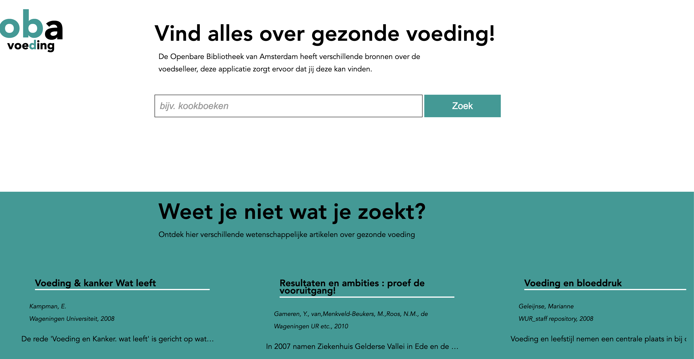

# OBA voeding 🍓🥬
OBA voeding is een aftakking van de OBA. (Openbare Bibliotheek Amsterdam). Binnen deze applicatie kan door je allerlei verschillende bronnen zoeken over gezonde voeding die de OBA in hun archief heeft.  




### User story
Voor dit project heb ik de onderstaande user story gekozen;
#### Voeding en diëtiek
Als sportieve twintiger wil ik mij verdiepen in het effect van gezonde voeding op mijn conditie, om te leren hoe ik mijn sport beter kan beoefenen.

Ik heb een op voeding en voedingsleer gezocht op de website en daar zag ik een aantal interessante onderwerpen naar voren komen:
* Holistisch (je eigen lichaam helen d.m.v. voeding)
* Kookboeken 
* Afslanken
* Chinese voedingsleer 
etc.

Doordat er zoveel verschillende interessanten invalshoeken bestaan over gezonde voeding, heb ik heb besloten om in deze SPA een zoekfunctie binnen de query 'voedingsleer' te maken zodat gebruikers zelf kunnen zoeken. Zoals bijvoorbeeld `kookboeken` of `hormonen`.


<!-- als gebruiker X wil ik graag Y zodat ik Z kan bereiken -->

<!-- Add a link to your live demo in Github Pages -->
### Live demo 🌐
De applicatie staat live op mijn github pages, alleen werkt één van de twee API's helaas niet. Die werkt alleen wanneer je lokaal op je localhost draait.
[Live website](https://kiara1404.github.io/voeding)
#### Screen shots


### Installation ⚙️

#### Clone this repository
```
git clone https://github.com/kiara1404/project-1-2021
```

#### Run the application
```
Om de applicatie te kunnen gebruiken, moet je gebruik maken van een live server
```
<!-- ...but how does one use this project? What are its features 🤔 -->

<!-- Maybe a checklist of done stuff and stuff still on your wishlist? ✅ -->
### Checklist ✅
Doordat de applicatie binnen één week gebouwd is, zitten er nog veel schoonheidsfoutjes in. Ook heb ik een lijstje wat ik graag nog had willen toevoegen maar helaas niet gelukt is door tijdgebrek;

* Error state
* Loading state
* Het kunnen opslaan van bronnen    
* Een filter op de resultaten pagina
* Het kunnen navigeren door alle resultaten van de API's. De API's laten alleen de eerste 20 resultaten zien, ik had graag knoppen toegevoegd die dit hadde kunnen doen.
* shuffle van de artikelen op de homepage.


<!-- How about a license here? 📜 (or is it a licence?) 🤷 -->
### License ©
[MIT LICENSE ]()

Het maken van de applicatie was een project één week van de minor web design & web development van de opleiding CMD van de Hogeschool van Amsterdam.
